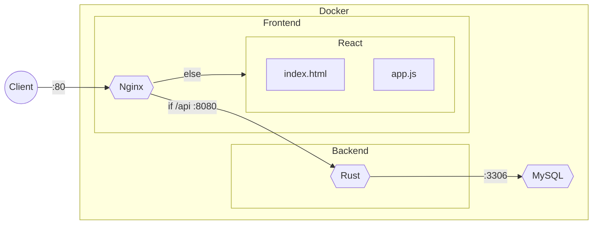

# react-actix-template

A minimal start for building full-stack applications.
Complete with Docker for easy setup and deployment.

## Tech Stack

Lightweight and fast with minimal **frontend** using compiled React and a performant and secure **backend** with Rust and Actix Web, robust and reliable with MySQL for the **database**.

The project is built using the following technology stack:

- Database: **MySQL**
- Backend: **Rust**
  - Framework: **Actix Web**
  - DMS/ORM: **Diesel**
- Frontend: **Nginx**
  - Framework: **React** *(Compiled)*
  - Proxy:
    - `/*` -> **Static Files**
    - `/api/*` -> **Backend**

It uses a monorepo structure with the following directories:

```rb
/
├── backend/            # Rust backend
│   └── Dockerfile      # Dockerfile for backend
├── frontend/           # React frontend
│   ├── Dockerfile      # Dockerfile for frontend
│   └── nginx/          # Nginx server
│       └── nginx.conf  # Nginx configuration
└── docker-compose.yml  # Docker Compose configuration
```

## Architecture

The following diagram shows the flow of the application,
from the client to the frontend, backend and the database.
Note that the frontend is served by Nginx and the backend by Actix Web running on Rust.



## Setup

1. Install [Rust](https://www.rust-lang.org/tools/install), [Node.js](https://nodejs.org/en/download/), and [Docker](https://docs.docker.com/get-docker/).
2. Create `.env` file in the root directory and add *(at least)* the following:

    ```sh
    MYSQL_ROOT_PASSWORD="<long_secure_password_here_1234>"
    MYSQL_HOST=mysql_db
    MYSQL_PORT=3306
    MYSQL_DATABASE="<database_name_here>"
    DATABASE_URL="mysql://root:${MYSQL_ROOT_PASSWORD}@${MYSQL_HOST}:${MYSQL_PORT}/${MYSQL_DATABASE}"
    DEV_MYSQL_HOST=localhost
    DEV_DATABASE_URL="mysql://root:${MYSQL_ROOT_PASSWORD}@${DEV_MYSQL_HOST}:${MYSQL_PORT}/${MYSQL_DATABASE}"
    ```

3. Install the Diesel CLI: `cargo install diesel_cli --no-default-features --features mysql`
4. Setup Diesel: `diesel setup`. This will create:
   - `migrations/` directory
   - `diesel.toml` file
   - `schema.rs` file.
5. Create a initial migration: `diesel migration generate initial`. New migration folder in `migrations/`.
6. Run the migration: `diesel migration run`.
7. Run the project: `docker-compose up --build -d`.
8. The project will be available at http://localhost:80/.
9. To stop the project: `docker-compose down -v`.

## Development

I personally suggest **running all docker containers** to ensure that the project is running correctly in your local environment as a start, making sure that the infrastructure is in place and working correctly.
**Then stop the container in which you are working** and run the partial project in development mode.
This will allow you to make changes to the code and see the changes in real-time, without having to rebuild each time.

### Backend

The template provides certain backend functions to quickly get started with development.

- `DEV_MODE=true` - Enables the development mode for the backend connecting to the local MySQL database.
- `src/db.rs` - Database connection and query functions.

### Frontend

The template provides a basic installation of **Create React App** with a proxy to the backend.

## Not Included

- HTTPS (SSL/TLS)
- Authentication
- Testing
- Logging

## Contributing

Feel free to contribute to this project by creating a pull request.

## License

This project is licensed under the MIT License - see the [LICENSE](LICENSE) file for details.
